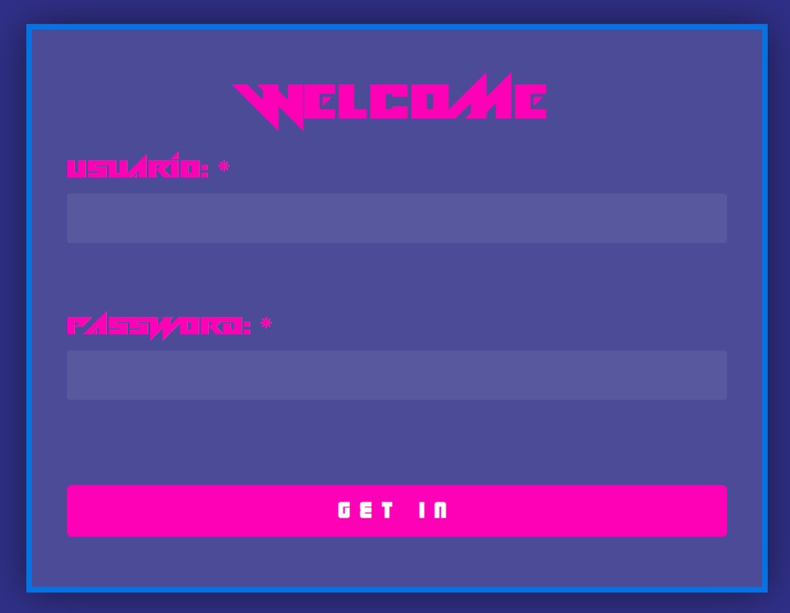
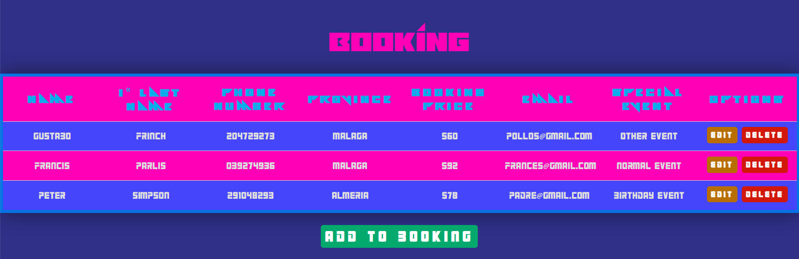
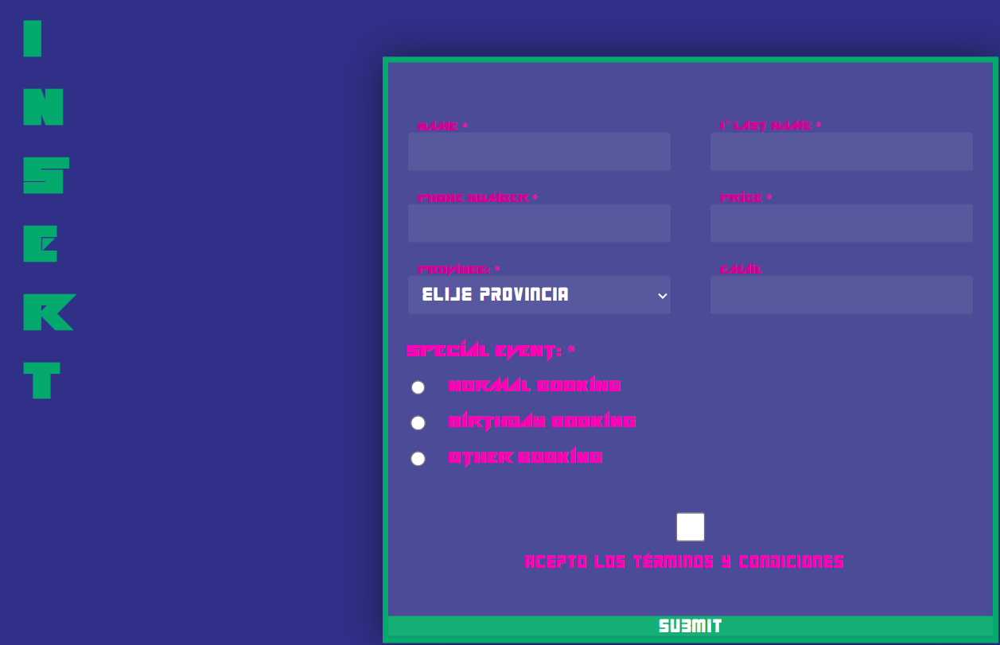
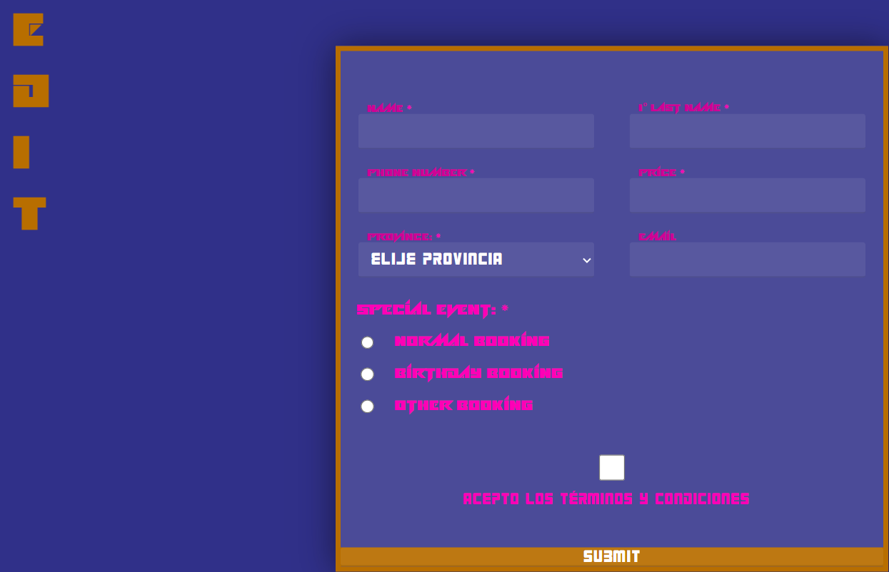

<h1>Project Memory for Markup Languages Evaluation - 1st DAW</h1>
<h2>Customer_Database Crud</h2>
<h2>Index</h2>
<ul>
  <li><a href="#introduction">Introduction</a></li>
  <li><a href="#motivation">Motivation</a></li>
  <li><a href="#structure">Structure</a></li>
  <li><a href="#style">Style</a></li>
</ul>

<h2 id="introduction">Introduction</h2>

Work done by: Miguel Ángel Ávila Rosas

Web project bootstrap for the 2st Markup Languages evaluation

March 2024

CC-BY License

<h2 id="motivation">Motivation</h2>

The chosen theme comes from the idea of making a customer database about the bookings of a restaurant. It has a login, a list, a page to add bookings and a page to change bookings

<h2 id="structure">Structure</h2>

The are four pages:

<ul>
  <li>Login</li>
  <li>List</li>
  <li>Insert</li>
  <li>Edit</li>
</ul>

<h3>Login</h3>

This login page asks for your name and password as a worker in the restaurant, to see if you can have access. 
There are rules for each input:

<ul>
  <li>Name: The user must have at least 8 characters, and a max of 12 characters.</li>
  <li>Password: The password must have a capital letter, Lower-case, special characters, be between 8-15 and at least one digit.</li>
</ul>

<h3>List</h3>

In this page, you can see all the bookings of the restaurant in real time, giving you the choice of adding, changing, or deleting a booking. 
If you want to change or delete a customer, a message will pop up and ask you if you are sure of what you want to do.

<h3>Insert</h3>

This section allows a worker to add a new booking to the list of bookings, and it has the next inputs:

<ul>
  <li>Name: Just fill with your name.</li>
  <li>1º Last Name: Must include 5 to 12 letters.</li>
  <li>Phone Number: Must include at least 9 numbers.</li>
  <li>Price: Must have at least two numbers, the price of the booking.</li>
  <li>Province: Must select a province, that dosen't include the default option.</li>
  <li>Email Address: Please enter a valid email address.</li>
  <li>Special Event: Select the booking option that the customer is interested in.</li>
  <li>Terms: Must accept the terms and conditions with a check.</li>
</ul>

<h3>Edit</h3>

This page is just like the insertion page, but to change the info of a booking.

<h2 id="style">Page Style</h2>

<h3>Color Palette</h3>

I choose a colorful and modern color palette, something futuristic and "cool" in some way.

<h3>Typography</h3>

Here is the link where I found the two font types:

<ul>
  <li><a href="https://www.dafont.com/alien-ravager.font" target="_blank">Title</a></li>
  <li><a href="https://www.dafont.com/robot-9000.font" target="_blank">Main Text</a></li>
</ul>

<h2 id="snippets">Templates</h2>

Here are all the templates I used for the pages:

<ul>
  <li><a href="https://codepen.io/fghty/pen/PojKNEG" target="_blank">Login</a></li>
  <li><a href="https://divtable.com/table-styler/" target="_blank">Listado</a></li>
</ul>
